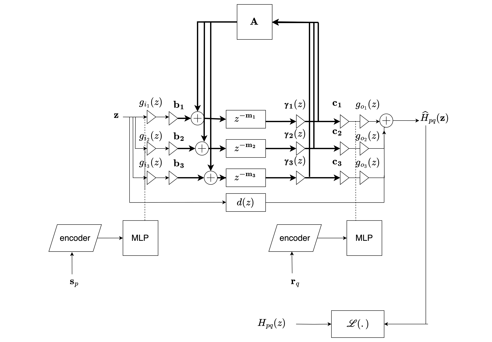

# Data-driven spatially dynamic late reverberation rendering in coupled spaces for Augmented Reality

## Differentiable Grouped Feedback Delay Networks for late reverberation modelling in coupled spaces

We proposed the Grouped Feedback Delay Network [1-3] to model multi-slope decay in late reverberation, which is commonly observed in coupled rooms and rooms with non-uniform absorption.
While the network is highly parameterised, it is still tricky to model a measured space by tuning its parameters. In this work, we automatically learn the parameters of the GFDN to model multi-slope reverberation in a measured complex space. The network has learnable source and receiver filters at its input and output, which are functions of the source and listener positions. The source-listener filter parameters are learned using a Multi-Layer Perceptron which takes Fourier encoded spatial coordinates as input. The coupled feedback matrix, and input-output gains, on the other hand, determine the echo density profile and colouration of the network, and are position-independent. These are also learnt during training.

A dataset of RIRs measured in a coupled space, along with the corresponding source and receiver positions, can be used to train the Differentiable GFDN. Now, if we want to extrapolate the RIR at a new (unmeasured) position, we can do that with the
GFDN. More powerfully, we can parameterise the late reverberation in the entire space with this very efficient network which is ideal for real-time rendering. This not only
reduces memory requirements of storing measured RIRs, but is also faster than convolution with long reverberation tails.

### Dataset
We have been using the dataset published [here](https://zenodo.org/records/13338346) which has three coupled rooms simulated with Treble.
This has been saved in `resources/Georg_3Room_FDTD/`. The mat files are converted to pickle files (for faster loading) using the script `python3 src/convert_mat_to_pkl.py`

Additionally, we have tools for generating a synthetic dataset of coupled rooms by shaping noise (see [gdalsanto/slope2noise](https://github.com/gdalsanto/slope2noise/blob/main/config/rir_synthesis_coupled_room.yml)). 

To generate your own datasets,
- Set up the submodules (see [CONTRIBUTING.md](CONTRIBUTING.md)). 
- Navigate to `submodules/slope2rir` and run `python3 main.py -c <config_path>`. An example of a config file to generate a coupled room dataset is available [here]( submodules/slope2rir/config/rir_synthesis_coupled_room_single_batch.yml).

To work with the files that we have tested on, use `git lfs`.
- Install with `brew install git lfs`
- Go to repo, and run `git lfs install`
- Add the appropriate file with `git lfs track <filepath>`
- Add and commit the file. Push it to origin.
- To download files tracked with LFS, run `git lfs pull origin <branch_name>`

To use an open-source dataset:
- Upcoming, not implemented yet!

### Training

- To set up the repo, follow the instructions in [CONTRIBUTING.md](CONTRIBUTING.md). 
- To run training on a single receiver position, create a config file (example [here](./data/config/single_rir_fit_broadband_two_stage_decay_colorless_prototype.yml)). 
- To run training of a full-band GFDN a grid of receiver positions, create a different config file (example [here](./data/config/treble_data_grid_training_full_band_colorless_loss.yml)). Then run `python3 src/run_model.py -c <config_file_path>`. 
- To run training with one DiffGFDN for each subband, filter the dataset into octave bands (see `src/convert_mat_to_pkl`), create config files for each band, and run the training for each config file. Alternately, see `python3 src/run_subband_training_treble.py`

Several different model configurations can be trained (see [config.py](.src/diff_gfdn/config/config.py)). There are options for:
- Training the output filters for a single position (with stochastic gradient descent), or for a grid of positions (with MLPs).
- Switching between source-receiver filters and gains
- Switching between absorption filters and gains
- Switching between different structures of feedback matrices


<!--
### Model architecture

<div align="center">

</div>

- The network is trained with the frequency-sampling method to make it differentiable. In this method, the transfer function of the GFDN is calculated at densely spaced points on the unit circle.
- The delay line lengths, $\mathbf{m}_i$, are co-prime and fixed, and the absorption gains/filters, $\mathbf{\gamma}_i(z)$, are derived from the common decay times of the RIRs [4].
- We use an MLP to train the source and receiver filters, $\mathbf{g}_i(z), \mathbf{g}_o(z)$, of the DiffGFDN. The inputs into the MLP are $(x,y,z)$ spatial coordinates encoded with Fourier transformations.
- The outputs of the MLPs are:
	- For a single full-band GFDN: state-variable filter (SVF) resonances and gains which are then converted into a parametric equaliser (PEQ). The PEQ consists of a cascade of biquad filters with cutoff frequencies at octave bands.
	- For a subband GFDN: scalar gains.
- For a GFDN with $N$ delay lines, $N_{group}$ groups and $N_{del} = \frac{N}{N_{group}}$ delay lines per group, the block diagonal feedback matrix, $\mathbf{A} \in \mathbb{R}^{N \times N}$ is given by, 
``` math
\begin{align*}
A(z) &=
\begin{bmatrix}
\mathbf{M_1} & \mathbf{0} & \ldots & \mathbf{0} \\
\mathbf{0} &  \mathbf{M_2} & \ldots & \mathbf{0} \\
\vdots & \vdots & \ddots & \vdots \\
\mathbf{0} & \mathbf{0} & \ldots & \mathbf{M}_{N_{group}}
\end{bmatrix} \\
 &\mathbf{M_i}^H \mathbf{M_i} = \mathbf{I}
 \end{align*}
```
where $\mathbf{M_i} \in \mathbb{R}^{N_\text{del} \times N_\text{del}}$ is the unitary mixing matix for each individual group. The unitary matrices are parameterised as,
```math
\begin{align*}
\mathbf{M_i} = \exp \left(\mathbf{W}_{i_\text{Tr}} - \mathbf{W}_{i_\text{Tr}}^T \right),
\end{align*}
``` 
where $\exp$ denotes the matrix exponential, and $\mathbf{W}_{i_\text{Tr}}$ is the upper triangular part of a real-positive matrix $\mathbf{W_i} \in \mathbb{R}^{N_{del} \times N_{del}}$, which is learned during training.
- The input-output gains, $\mathbf{b, c}, \in \mathbb{R}^{N \times 1}$ are also learned during training.
- The transfer function of the DiffGFDN for the $(p,q)$th source-receiver position is given by,
```math
\begin{align*}
\widehat{H}_{pq}(z) &= \mathbf{c}_p^T(z) \left[\mathbf{D_m}^{-1}(z) \mathbf{\Gamma}^{-1}(z)- \mathbf{A}\right]^{-1} \mathbf{b}_q(z) + d(z), \\
\mathbf{c}_p(z) &= \mathbf{c} \odot (\mathbf{g_i}_p(z) \otimes \mathbb{1}), \qquad \mathbf{b}_q(z) = \mathbf{b} \odot (\mathbf{g_q}_j(z) \otimes \mathbb{1}) \\
\mathbf{D_m}(z) &= \text{diag} \left(z^{-m_1}, \ldots, z^{-m_N} \right), \qquad \mathbf{\Gamma}(z) = \text{diag} \left(\gamma_1(z), \ldots, \gamma_N(z) \right)
\end{align*}
```

### Loss function

To match a desired impulse response at a source-receiver location $H_{pq}(z)$, we minimise the normalised energy decay relief (EDR) loss between the DiffGFDN's output, $\hat{H}_{pq}(z)$,  and the desired RIR at each location,

``` math
\begin{align*}
\text{EDR}(k, m) &= 10 \log_{10} \left(\sum_{\tau=m}^M |H_{pq}(k, \tau) |^2 \right) \\
\mathcal{L}_{\text{EDR}} &= \frac{ \sum_k \sum_m |EDR_{H_{pq}}(k, m) - EDR_{\widehat{H}_{pq}}(k, m)|}{\sum_k \sum_m |EDR_{H_{pq}}(k, m)|}
\end{align*}
```

We also include an energy decay curve (EDC) matching loss, given by,

```math
\begin{align*}
\text{EDC}(t) &= 10 \log_{10} \left(\sum_{l=t}^T h_{pq}(l) \right) \\
\mathcal{L}_{\text{EDC}} &= \frac{1}{T} \sum_{t=1}^T \left| \text{EDC}_{h_{pq}}(t) - \text{EDC}_{\widehat{h}_{pq}}(t) \right| 
\end{align*}
```

To ensure that the GFDN is colourless, and has sufficient echo density, we also include spectral and colouration losses, given by:
```math
\begin{align*}
\mathcal{L}_{\text{spectral}} &=\sum_{i=1}^{N_{group}} \frac{1}{K} \sum_{k=1}^K \left( |\mathbf{c}_i^T (D_{\mathbf{m}_i}(z_k^{-1}) - \mathbf{M}_i)^{-1} \mathbf{b}_i |^2 - 1 \right), \qquad z_k = e^{j\omega_k} \\
\mathcal{L}_{\text{sparsity}} &= \sum_{i=1}^{N_{group}} \frac{N_{del} \sqrt{N_{del}} - \sum_{m,n}|\mathbf{M}_i(m,n)|}{N_{del}\sqrt{N_{del}} - 1}
\end{align*}
```
-->

## Directional late reverb modelling in coupled spaces

As part of this work, we also investigated the modelling of position-dependent directional late reverberation. We assume we have a set of <b> Spatial Room Impulse Responses (SRIRs) </b> (encoded in $N_\text{sp}$ order ambisonics) measured at several locations in the space for a fixed source-position. We want to use these to generalise the late reverb tail of the SRIRs at any point in the room. 

To do this, we leverage the <b>Common Slopes (CS)</b> model which hypotehises that the energy decay in any coupled space can be modelled as a weighted sum of a handful of decay kernels with unique reverberation times, which are position-invaiant. The weights of the decay kernel are known as the CS amplitudes, and are position and direction-dependent. We train MLPs in octave bands to learn the CS amplitudes in the spherical harmonic (SH) domain as a function of position. The loss function used is a directional energy decay loss. Once trained, the MLPs can predict the CS amplitudes in the SH domain at any new position in space. Shaped white noise with the predicted CS parameters is used to synthesise the directional late reverberation tail. As the user navigates the space, the MLPs update the CS amplitudes and time-varying convolution is performedwith the synthesised late reverberation tail. Since the predicted late-reverb tail is an ambisonics signal, it is trivial to rotate it according to the user's head-orientation, thus enabling 6DoF rendering of late reverberation for AR applications.

The scripts for training this model are in the [src/spatial_sampling](src/spatial_sampling/) folder. To run training on the three coupled room dataset which has $2$nd order ambisonic SRIRs, you can run the script [src/run_spatial_sampling_test.py](src/run_spatial_sampling_test.py)


## Publications

- <i>Neural-network based interpolation of late reverberation in coupled spaces using the common slopes model</i> - Das, Dal Santo, Schlecht and Zvetkovic, submitted to IEEE Workshop on Application of Signal Processing to Audio and Acoustics, IEEE WASPAA 2025.
- <i>Differentiable Grouped Feedback Delay Networks: Learning from measured Room Impulse Responses for spatially dynamic late reverberation rendering</i> - Das, Dal Santo, Schlecht and Zvetkovic, submitted to IEEE Transactions on Audio, Speech and Language Processing, IEEE TASLP, 2025.


## Future work

The DiffGFDN is an omni-directional renderer, whereas for directional rendering, we have proposed a convolution-based renderer, which is much more inefficient. Since we have demonstrated that simple neural networks like MLPs are capable of learning directional late reverberation properties, we wish to work on a directional DiffGFDN which operates in the ambisonics domain for efficient 6DoF late reverb modelling.

## Sound examples

Mono sound examples of the DiffGFDN are available [here](https://ccrma.stanford.edu/~orchi/FDN/GFDN/DiffGFDN/) and binaural sound examples of convolution-based directional rendering are available [here](https://ccrma.stanford.edu/∼orchi/FDN/GFDN/DiffGFDN/WASPAA25/).
