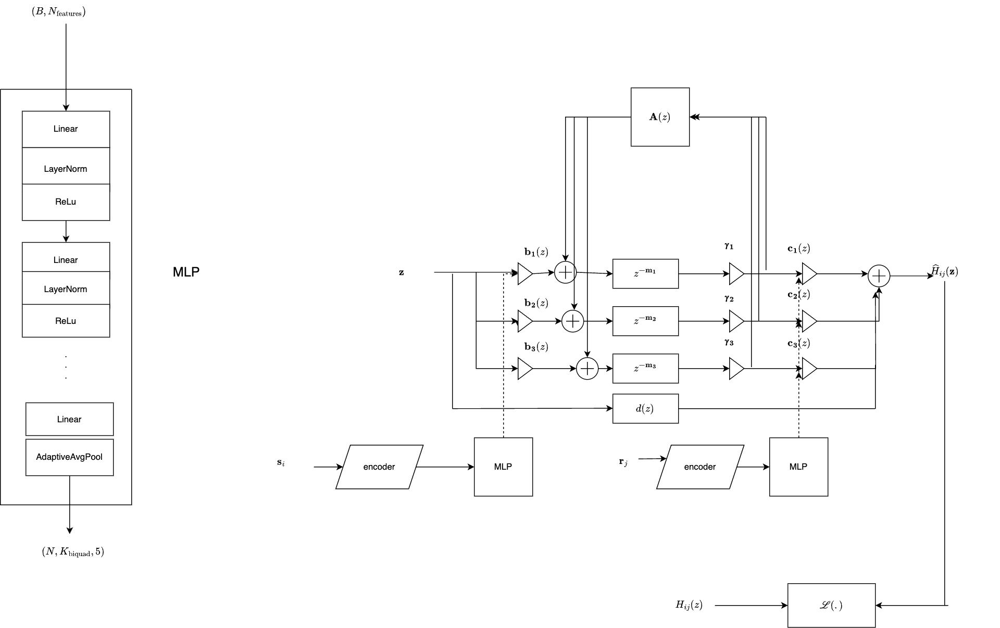

# Differentiable Grouped Feedback Delay Networks

We proposed the Grouped Feedback Delay Network [1-3] to model multi-slope decay in late reverberation, which is commonly observed in coupled rooms and rooms with non-uniform absorption.
While the network is highly parameterised, it is still tricky to model a measured space by tuning its parameters [2]. In this work, we automatically learn the parameters of the GFDN to model
a measured coupled space. The network input and output filters are assumed to be functions of the source and listener positions, which determine the net perceived late reverberation in coupled spaces; for example: a receiver in the more reverberant space and a source in the less reverberant space will lead to two-stage decay with a fast early decay and late slow decay. If we swap the source and the listener, the effect changes. To model this spatial distribution of the late tail, we train the input and output filters of the GFDN with deep learning. The coupled feedback matrix, on the other hand, is hypothesised to be a function of the room geometries, diffusion properties and coupling apertures, and is position-independent. This is also learnt during training with backpropagation.

The idea to use a dataset of RIRs measured in a coupled space to learn the spatial embeddings. Now, if we want to extrapolate the RIR at a new (unmeasured) position, we can do that with the
Differentiable GFDN. More powerfully, we can parameterise the late reverberation in the entire space with this very efficient network which is ideal for real-time rendering. This not only
reduces memory requirements of storing measured RIRs, but is also faster than convolution for long reverberation tails.

## Dataset
We have been using the dataset published [here](https://zenodo.org/records/13338346) which has three coupled rooms simulated with Treble.
This has been saved in `resources/Georg_3Room_FDTD/`. The mat files are converted to pickle files (for faster loading) using the script `python3 src/convert_mat_to_pkl.py`


Additionally, we have tools for generating a synthetic dataset of coupled rooms by shaping noise (see [gdalsanto/slope2noise](https://github.com/gdalsanto/slope2noise/blob/main/config/rir_synthesis_coupled_room.yml)). Set up the submodules (see [CONTRIBUTING.md](CONTRIBUTING.md)). Navigate to `submodules/slope2rir` and run `python3 main.py -c <config_path>`. An example of a config file to generate a coupled room dataset is available [here]( submodules/slope2rir/config/rir_synthesis_coupled_room_single_batch.yml).

**TO-DO**
- Set up git-lfs for dataset storage 

## Training

- To set up the repo, follow the instructions in [CONTRIBUTING.md](CONTRIBUTING.md). 
- To run training on a single receiver position, create a config file (example [here](./data/config/single_rir_fit_random_coupling_out_gains.yml)). 
- To run training on a grid of receiver positions, create a different config file (example [here](./data/config/antialiasing_reg_loss_more_layers_random_coupling.yml)) Then run `python3 src/run_model.py -c <config_file_path>`. 

Several different model configurations can be trained (see [config.py](.src/diff_gfdn/config/config.py)). There are options for:
- Training the output filters for a single position, or for a grid of positions (with deep learning).
- Switching between output filters and gains
- Switching between absorption filters and gains
- Switching between different structures of feedback matrices


## Model architecture



- The network is trained with the frequency-sampling method to make it differentiable.
- We use an MLP to train the input and output filters of the DiffGFDN. The inputs into the MLP are either 1) $(x,y,z)$ spatial coordinates encoded with Fourier transformations OR 2) a 3D meshgrid of the space's geometry with a 4th dimension (one-hot vector) denoting where the source/receivers are located in the space. The input tensor size is $(B, L)$
- The output of the MLP are state-variable filter (SVF) coefficients which are then converted into a cascade of biquad IIR filters. For a model with $N$ delay lines and $K_{\text{biquad}}$ cascaded biquads, the MLP should output a tensor of size $(B, N, K_{\text{biquad}}, 5)$.
- The feedback matrix, $A(z)$ has a unique structure that is given by
``` math
\begin{align*}
A(z) &=
\begin{bmatrix}
\Phi_{11}(z) \mathbf{M_1}^2 & \Phi_{12}(z) \mathbf{M_1M_2} & \Phi_{13}(z) \mathbf{M_1M_3} \\ \Phi_{21}(z) \mathbf{M_2M_1} & \Phi_{22}(z) \mathbf{M_2}^2 &   \Phi_{23}(z) \mathbf{M_2M_3}\\
\Phi_{31}(z) \mathbf{M_3M_1} &  \Phi_{32}(z) \mathbf{M_3M_2} & 
 \Phi_{33}(z) \mathbf{M_3}^2
\end{bmatrix} \\
 &\Phi(z) \Phi^H(z^{-1}) = \mathbf{I}, \quad \mathbf{M_i}^H \mathbf{M_i} = \mathbf{I}
 \end{align*}
```
where $\mathbf{M_i} \in \mathbb{R}^{N_\text{del} \times N_\text{del}}$ is the unitary mixing matix for each individual room, and $\Phi(z) \in \mathbb{R}^{N_\text{room} \times N_\text{room} \times p}$ is the paraunitary coupling matrix. The unitary matrices are represented as exponentiated skew symmetric matrices which are learnt during training, and the paraunitary matrix is constructed from degree-1 Householder reflections, given by
```math
\Phi(z) = \prod_{i=1}^p (\mathbf{I} - (1-z^{-1})) \mathbf{u_i u_i}^H, \quad s.t., \ \mathbf{u_i}^H \mathbf{u_i} = 1
```
where the $\mathbf{u_i}$'s are learnt during training.

### Loss function

To match a desired impulse response at a source-receiver location $H_{ij}(z)$, we minimise the normalised energy decay relief (EDR) loss between the DiffGFDN's output, $\hat{H}_{ij}(z)$,  and the desired RIR at each location,

``` math
\begin{align*}
\text{EDR}(k, m) &= 10 \log_{10} \left(\sum_{\tau=m}^M |H_{ij}(k, \tau) |^2 \right) \\
\text{EDR}_{\text{loss}} &= \frac{ \sum_k \sum_m |EDR_{H_{ij}}(k, m) - EDR_{\hat{H}_{ij}}(k, m)|}{\sum_k \sum_m |EDR_{H_{ij}}(k, m)|}
\end{align*}
```